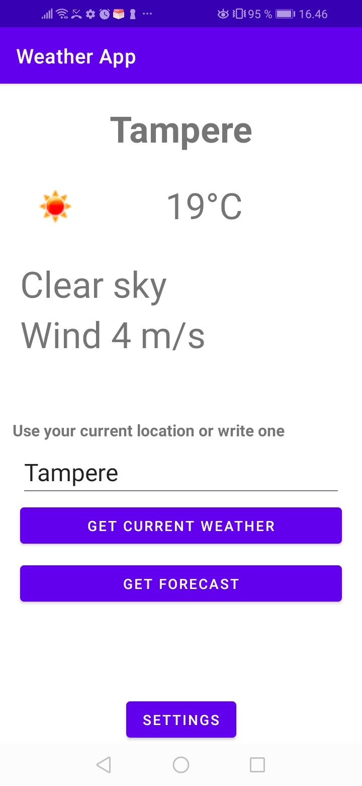
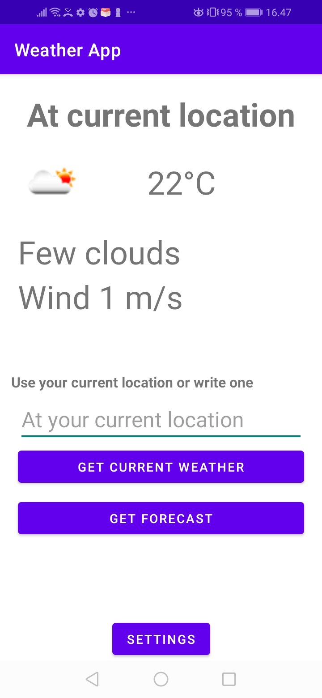
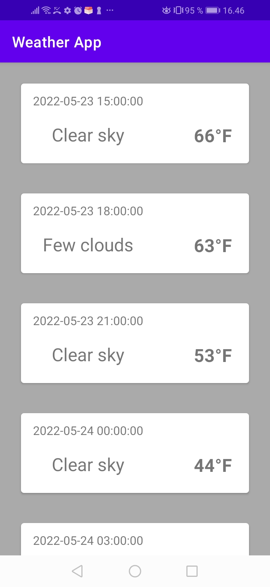
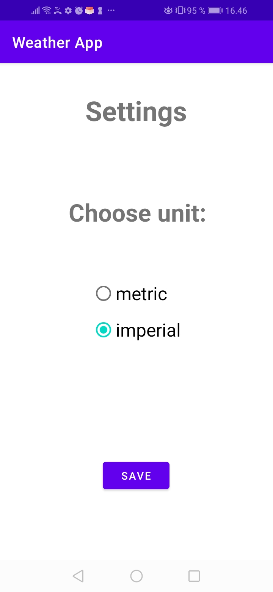

# Android-Weather-App
Course project for TAMK Native Mobile App Development course.

### Developed by
Joni Honkanen

### Description
This project is a weather application for Android mobile devices. 
It uses Open Weather Map for receiving weather data from servers and displaying it on user's device.
The application allows user to fetch weather data based on a given location (city name) or user's current location (GPS or Network via device).

### API used
https://openweathermap.org/api

### Limitations
This application uses free subscription plan for API key. It comes with the following restrictions regarding API calls:
- Only 60 calls per minute
- Max 1 000 000 per month
- 1000 API calls per day

### Platform
Android (Kotlin)

### Minimum SDK
21

### Key features:
- Fetch current weather info for a given location
- Fetch weather info for user's current location
- Fetch a weather forecast for next several hours
- Option for metric or imperial measurement units

### Screenshots

### Screencast
https://youtu.be/4p88LRzkyG8

### Google Play link
Not likely to be implemented (limitations with API key)
